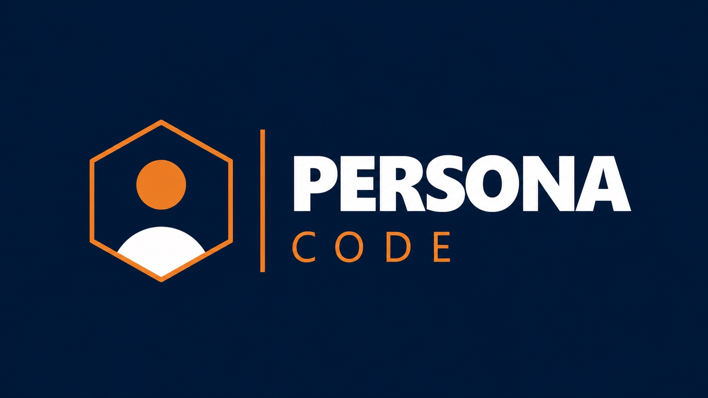

<p align="center">
  
</p>

# ---------- PersonaCode ----------

> Transformando a Tríade do Tempo em uma ferramenta de desenvolvimento humano contextualizado.

O classificador de perfil do PersonaCode é inteiramente baseado na **Tríade do Tempo de Christian Barbosa** — metodologia criada originalmente para o contexto corporativo adulto. Diante da percepção de que o que é importante é relativo à fase de vida de cada pessoa, o PersonaCode tornou o classificador de perfil acessível e consistente a diferentes faixas etárias, transformando uma ferramenta de diagnóstico em uma **ferramenta de desenvolvimento humano contextualizado**.

-------------------------------------------------------------------------------------------------------------------------------------------

# ---------- Funcionalidades ----------

- 📋 Quiz interativo com perguntas adaptadas por faixa etária
- 🎯 Classificação em 5 perfis baseados na Tríade do Tempo
- 💡 Resultado personalizado com dica de desenvolvimento
- ♿ Interface pensada com foco em acessibilidade e usabilidade (IHC/UX)
- 🖥️ Aplicação desktop com interface gráfica moderna (CustomTkinter)

-------------------------------------------------------------------------------------------------------------------------------------------

# ---------- Fluxograma do projeto ----------

[🔗 Ver fluxograma no Figma](https://www.figma.com/board/c6q1O2t2PPfnbraqI81k63/Untitled?node-id=0-1&t=jzPKI5iRTQi65pPr-1)

-------------------------------------------------------------------------------------------------------------------------------------------

# ---------- Sitemap do projeto ----------

[🔗 Ver sitemap no Figma](https://www.figma.com/board/e511WVHkhReGzajyPpTbLY/Site-Map?node-id=0-1&t=ahM6U177wzQsGpA4-1)

-------------------------------------------------------------------------------------------------------------------------------------------

# ---------- Estrutura do Projeto ----------

```
PersonaCode/
├── docs/
    └── perguntas.py       # Banco de perguntas por faixa etária
    └── resultados.py      # Perfis e descrições do resultado
    └── __init__.py        # Reconhecimento de pasta como Pacote Python
├── interface/
│   └── logo2.png          # Logo da aplicação
    └── tela.py            # Interface gráfica principal
├── main.py                # Arquivo de execução do programa
├── requirements.txt       # Dependências do projeto
├── .gitignore             # Arquivos ignorados pelo Git
└── README.md              # Documentação do projeto
```

-------------------------------------------------------------------------------------------------------------------------------------------

# ---------- Como executar ----------

**Pré-requisitos:** Python 3.10 ou superior e pip instalado.

```bash
# 1. Clone o repositório
git clone https://github.com/Francielix/personacode.git

# 2. Entre na pasta do projeto
cd PersonaCode

# 3. Instale as dependências
pip install -r requirements.txt

# 4. Execute a aplicação
python main.py
```

-------------------------------------------------------------------------------------------------------------------------------------------

# ---------- Dependências ----------

| Biblioteca | Versão | Finalidade |

| customtkinter | ≥ 5.2.0 | Interface gráfica moderna |
| Pillow | ≥ 10.0.0 | Carregamento de imagens |

-------------------------------------------------------------------------------------------------------------------------------------------

# ---------- Perfis identificados ----------

O PersonaCode classifica o usuário em um dos 5 perfis da Tríade do Tempo, adaptado para cada faixa etária:

| Perfil | Descrição resumida |

| 🟢 Importante | Foco no que realmente importa |
| 🔵 Equilibrado | Bom balanceamento entre as esferas |
| 🟡 Circunstancial | Reage ao ambiente e ao contexto |
| 🟠 Urgente | Vive apagando incêndios |
| 🔴 Crítico | Alta sobrecarga e baixo controle |

-------------------------------------------------------------------------------------------------------------------------------------------

# ---------- Equipe ----------

O PersonaCode foi desenvolvido por uma equipe de 8 pessoas, com cada membro contribuindo diretamente no código e nas diferentes frentes do projeto — desde a pesquisa da metodologia até a implementação de recursos de acessibilidade.

| Colaboradores

Franciele Couto 

Juliano Lacerda

Itallo Gustavo 

Klever S. Baliza

Yuri 

Breno 

Guilherme Roque 

Tallita

-------------------------------------------------------------------------------------------------------------------------------------------

# ---------- Base teórica ----------

- BARBOSA, C. *A Tríade do Tempo*. Editora Sextante, 2008.
- BENYON, D. *Interação Humano-Computador*. Pearson, 2011.
- BARRETO, J. S. et al. *Interface Humano-Computador*. Sagah, 2018.

-------------------------------------------------------------------------------------------------------------------------------------------

# ---------- Contexto acadêmico ----------

Projeto desenvolvido para as UCs de **Interação Humano-Computador e UX (IHC-UX)** e **Algoritmos e Programação**, com aplicação prática de conceitos de UX, acessibilidade e lógica de programação em Python.
